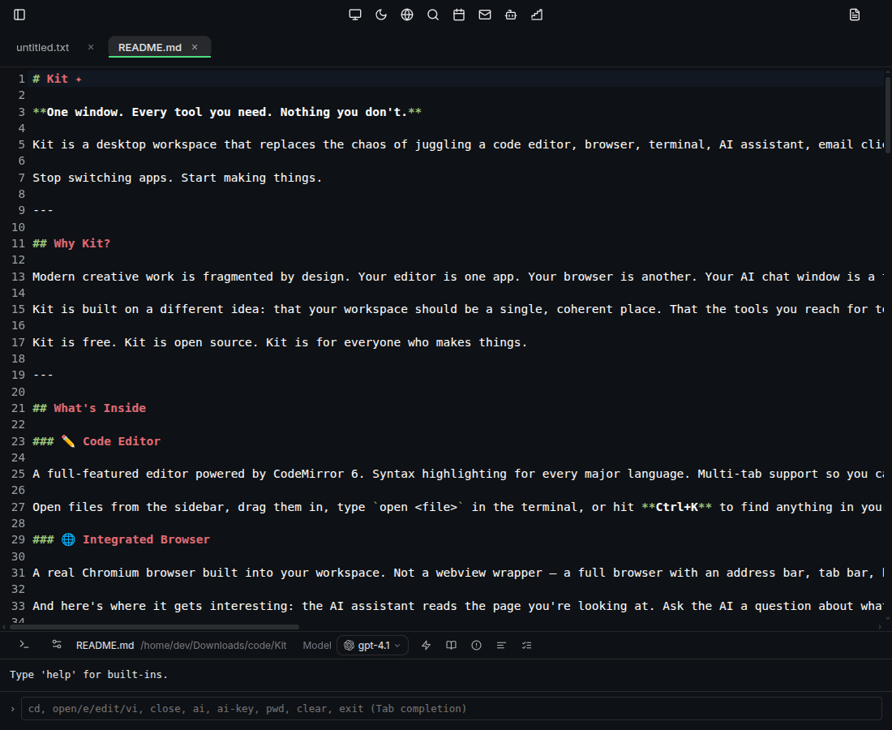

# Kit 🏵️

  [](LICENSE)  [](https://github.com/raiyanyahya/Kit/actions/workflows/ci.yml) [](https://github.com/raiyanyahya/Kit/actions/workflows/test.yml) [](https://github.com/raiyanyahya/Kit/releases/latest)

**Your entire dev environment. One window. AI woven through everything.**

Kit is not another Electron wrapper with a chat sidebar. It's a ground-up rethink of what a developer workspace looks like when AI is not a feature you reach for but the nervous system connecting every tool you already use. The editor, browser, terminal, git, email, calendar, whiteboard and an autonomous agent all share context. Nothing is siloed. Everything talks to everything.

Built by a developer who got tired of alt-tabbing between twelve apps to do one thing.



---

## Why Kit?

Every developer workflow is secretly the same. You write code in one window, look up docs in another, run commands in a third, manage git in a fourth and your AI assistant lives in a fifth tab that knows nothing about any of the others. The context switching is relentless and the cost is invisible until you add it up.

Kit is built on one idea: **the workspace should think with you, not just sit there.** When you open a file the AI knows. When you browse a doc the AI can read it. When you give the agent a task it uses your actual project not a blank slate. The tools aren't just co-located. They're connected.

It's also built to be extended. The agent tool system is explicit and composable. The pipeline runner is modular. The project rules system lets any codebase teach Kit how to behave. Fork it, extend it, wire in whatever you need. The architecture stays out of your way.

---

## 🔩 What's inside

### ✏️ Code Editor

A full editor built on CodeMirror 6 which is the same engine powering CodeSandbox, Replit and the next generation of browser-based IDEs. Syntax highlighting works out of the box for every major language. Multi-tab support means you work across files without closing anything. Font size, tab width and line wrap are all configurable. A dirty-state dot on each tab tells you what's unsaved at a glance.

Auto-save runs on a configurable interval. Session restore means you reopen Kit and pick up exactly where you left off with the same files and tabs. Markdown live preview opens a draggable split pane that hot-reloads as you type. F12 jumps to definition for any symbol in your file. Ctrl+Shift+P opens the command palette for everything else including opening files, triggering AI actions and toggling settings without touching the mouse.

The status bar runs three AI actions on the current file without leaving the editor:

**Summarise** reads the file and explains what it does in plain English covering key functions, inputs, outputs and dependencies.

**Check for errors** does a strict code review pass looking for bugs, edge cases, security pitfalls and style issues with line numbers on everything it finds.

**Generate tests** writes comprehensive unit tests including setup and teardown, edge cases, mocks and picks the right testing framework for the language automatically.

---

### 🌐 Browser

A real Chromium browser inside the workspace. Not a webview wrapper but a full browser with an address bar, tab bar, navigation history and bookmarks. Use it for docs, research, localhost, web apps or anything you'd normally open Chrome for.

The browser toolbar has four AI-powered actions built in. **Summarise page** reads the full text of whatever you're looking at and opens a clean summary in a detached window. **Extract text** pulls the raw readable text from the page so you can copy it or feed it into something else. **Screenshot** captures the current page as an image and opens it in a result window. **Bookmark** saves the current tab with its favicon to your sidebar so you can get back to it without searching.

The AI in the terminal also reads the page you're currently browsing as live context. You can ask it a question about the docs you have open without copying anything. The browser and the AI are genuinely aware of each other.

---

### 💻 Terminal

A full terminal where every system command runs exactly as it would anywhere else. `git push`, `npm install`, `docker compose up`, `python train.py` — anything your shell can do. Output streams line by line as it arrives so long-running processes show progress in real time. Ctrl+C kills any running process including nested ones.

Type `help` to see everything available.

**Navigation and files**
```
pwd                     Show current directory
cd <path>               Change directory
ls [path]               List files
open <file>             Open file in editor  (also: e, edit, vi)
close                   Close current file
```

**Environment**
```
export VAR=value        Set environment variable
unset VAR               Remove environment variable
env VAR                 View environment variable
```

**AI with full context**
```
/ai <prompt>                    Ask anything — AI sees your open file, browser page, calendar and bookmarks
/ai <prompt> --file             Include the current file as context
/ai <prompt> --path <p>         Include files from a specific path
/ai <prompt> --model <name>     Use a specific model for this request
```

**Code generation and review**
```
/ai code <description>          Generate code from a description
/ai complete --file             Complete the current function or class
/ai explain --file              Plain-English explanation of the current file
/ai fix <error> --file          Fix a specific bug or error
/ai test --file                 Generate unit tests
/ai refactor --file             Improve structure without changing behaviour
/ai optimize --file             Optimise for performance
/ai document --file             Generate documentation
/ai review --file               Full code review with suggestions
/ai convert <language> --file   Convert the file to another language
```

The AI in the terminal has full conversation memory for the session. It remembers what you said earlier, what file you had open and what you were browsing. You can switch models mid-conversation with `--model`. Every request is context-aware by default so the AI already knows your working directory, open file, browser URL, calendar events and saved bookmarks without you having to mention any of it.

Models update automatically when new versions of the app are released.

---

### 🔀 Git Panel

A full visual git interface so you don't need the terminal for the common path. You can see your current branch, commit SHA, modified files, untracked files and how far ahead or behind the remote you are. Stage individual files or everything at once with a checkbox, write your commit message, commit, pull and push all from a modal you open by clicking the git badge in the status bar.

The git badge updates every 3 seconds and shows real state including branch name, short SHA, ahead/behind count, modified file count and untracked file count. It only runs when you're inside a git repository so there's no background noise anywhere else.

---

### 🤖 Kit Agent

An autonomous AI agent you give tasks to in plain English. Not a chat window and not autocomplete. An actual agent that thinks, plans and acts in a loop with tools until the task is done.

Tell it *"Scaffold a REST API with authentication in Express, add rate limiting and write tests"* and it creates every file, installs the dependencies, writes the code and tells you what it built.

Tell it *"Find all the TODO comments across this project, group them by urgency and write a summary"* and it searches every file, reads the results and gives you a structured report.

Tell it *"The auth token isn't expiring correctly in auth.js, read it, find the bug and fix it"* and it reads the file, locates the issue, writes the fix and explains the change.

**The five tools the agent uses autonomously:**

| Tool | What it does |
|---|---|
| `read_file` | Read any file — always runs silently |
| `write_file` | Write or overwrite a file — asks permission first |
| `list_dir` | List directory contents — always runs silently |
| `run_command` | Execute any shell command — asks permission first |
| `search_project` | Full-text grep across the project — always runs silently |

Before any file write or shell command runs Kit shows you exactly what the agent is about to do and gives you three choices. **Allow once** runs this specific action and asks again next time. **Allow all** blanket-approves this type of action for the rest of the session. **Deny** skips it and the agent adapts. Permissions reset at the start of every new task so you're always in control.

Drop a `.kitrules` or `AGENT.md` file into any project folder and the agent reads it at the start of every task. Put your coding conventions, architecture decisions, what not to touch and preferred libraries in there. The agent follows them without being told twice.

Works with OpenAI and Anthropic. Models update automatically when new versions of the app are released.

---

### 🪜 Stairs — Workflow Automation

A visual pipeline builder for turning repetitive multi-step work into one-click automations. Build a workflow once, name it and run it whenever you need it.

You can chain four step types in any order. **AI** sends a prompt to any model and you can reference the previous step's output with `{{prev_step.output}}`. **Shell** runs any command and pipes outputs between steps. **HTTP** makes GET, POST, PUT, PATCH or DELETE requests with optional JSON body and headers. **File** reads, writes or appends to any file on disk.

Each step shows its output inline as it runs and you can stop mid-run if something looks wrong. Every step output feeds the next so the whole pipeline is connected.

Some things you could build: fetch data from an API then summarise it with Claude then write it to a daily report file. Or run your test suite then if there are failures draft an incident summary and write it to a log. Or read a log file then ask the AI to find anomalies then append the findings to a briefing.

---

### 🎨 Whiteboard

A freehand drawing canvas for when you need to think in shapes instead of text. Sketch an architecture, map out a flow or just work through an idea visually. It's one keystroke away with Ctrl+W and one keystroke back.

You get a pen, rectangles, ellipses, arrows, text, sticky notes, image upload, an eraser and select and move. Mind map mode lets you build connected node trees for brainstorming. There's a colour picker for every element and undo/redo with Ctrl+Z and Ctrl+Y. The board auto-saves so it's there when you come back and you can export it as a screenshot any time.

---

### 📁 Sidebar and Starred Folders

The sidebar shows your project file tree and updates live as files change. Hover any folder and star it to make it your default landing directory. The next time you open Kit the terminal, sidebar and git panel all open there automatically. One click on the star button in the toolbar jumps back to it from anywhere.

Bookmarks from the browser live in the sidebar too with favicons so you can get back to saved URLs without switching modes.

---

### 🔍 Project Search

Ctrl+K opens full-text search across your entire project searching both file names and file contents at the same time. Results appear as you type. Use arrow keys to navigate and Enter to open which jumps directly to the matching line in the editor. No configuration, no indexing and no waiting.

---

### 📧 Email

A full IMAP/SMTP email client you configure once and it works with Gmail, Fastmail, Outlook or any standard provider. Read threads, reply, compose, send, mark as read and move to trash without leaving your workspace.

---

### 📅 Calendar

A local event manager where you create events, set dates and times and see what's coming. Everything is stored in `~/.Kit/calendar.json` with no accounts, no sync and no cloud. Your schedule lives in the same window as your work and the AI can see it as context when you're asking questions.

---

## 🔌 Built to be extended

Kit is designed to grow. Adding a new agent tool means writing one case in a switch and registering it. The Stairs step runner is modular by design. Project rules mean the agent adapts to any codebase without touching source code.

The surface area is intentionally small. Fork it, add a tool, wire in a new AI provider, build a new step type for Stairs. The architecture gets out of your way.

---

## ⌨️ Keyboard shortcuts

| Shortcut | Action |
|---|---|
| `Ctrl+K` | Project search |
| `Ctrl+S` | Save file |
| `Ctrl+D` | Toggle dark / light theme |
| `Ctrl+E` | Toggle sidebar |
| `Ctrl+B` | Browser |
| `Ctrl+W` | Whiteboard |
| `Ctrl+M` | Email |
| `Ctrl+0` | Back to editor |
| `Ctrl+Shift+A` | Kit Agent |
| `Ctrl+Shift+R` | Stairs |
| `Ctrl+Shift+P` | Command palette |
| `F12` | Jump to definition |
| `Ctrl+Z` | Undo (whiteboard) |
| `Ctrl+Y` | Redo (whiteboard) |

---

## 🚀 Install

Download the latest release from the [Releases](https://github.com/raiyanyahya/Kit/releases) page.

**macOS** — download the `.dmg`, open it, drag Kit to Applications and run it.

**Linux** — download the `.AppImage`, make it executable and run it:
```bash
chmod +x Kit-*.AppImage
./Kit-*.AppImage
```

On first launch click the key icon in the status bar and add your OpenAI or Anthropic API key. Everything else is already there.

---

## 🛠 Build from source

```bash
git clone https://github.com/raiyanyahya/Kit.git
cd Kit
npm install
npm start
```

---

## 🗂️ Workspace

```
~/.Kit/
├── projects/        agent-created projects
├── data/            data files and datasets
├── scratch/         quick experiments
├── boards/          whiteboard saves
├── stairs/          saved workflows
└── calendar.json    calendar events
```

---

*Kit is for developers who want their tools to think with them.*

*If Kit is useful to you a ⭐ goes a long way and helps more people find it.*

---

<a target="_blank" href="https://icons8.com/icon/uSfbRTf3kxH4/seed-of-life">mandala</a> icon by <a target="_blank" href="https://icons8.com">Icons8</a>
